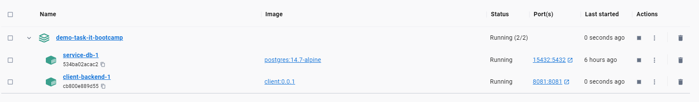
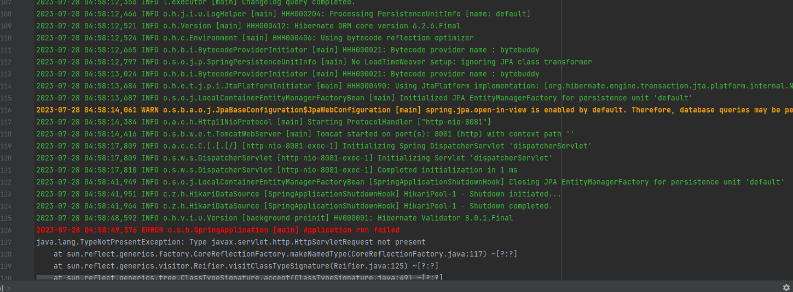
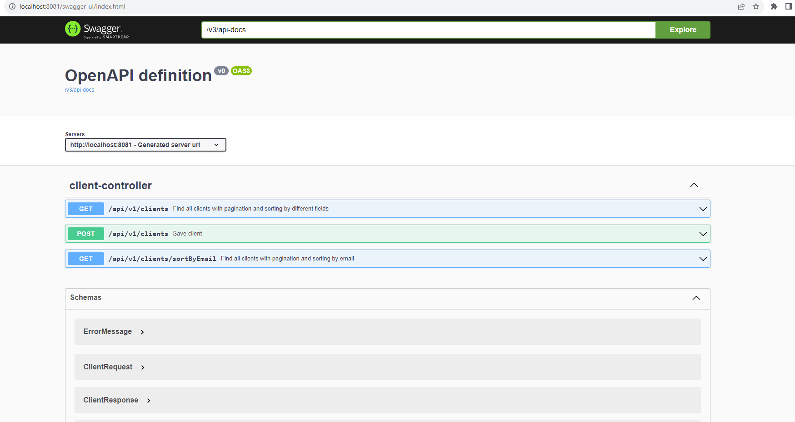
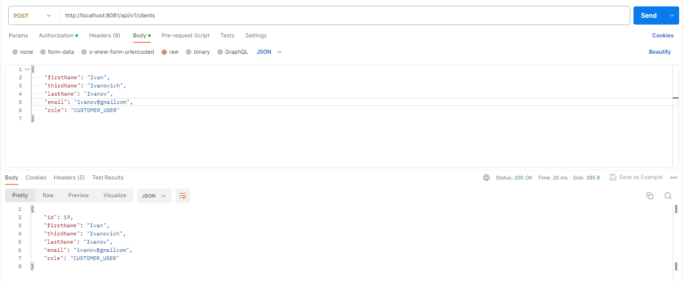
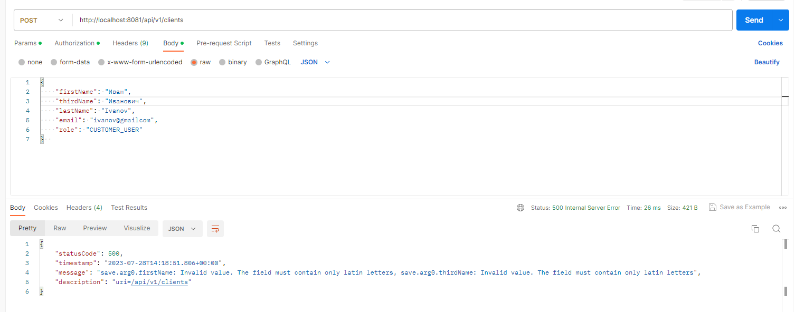
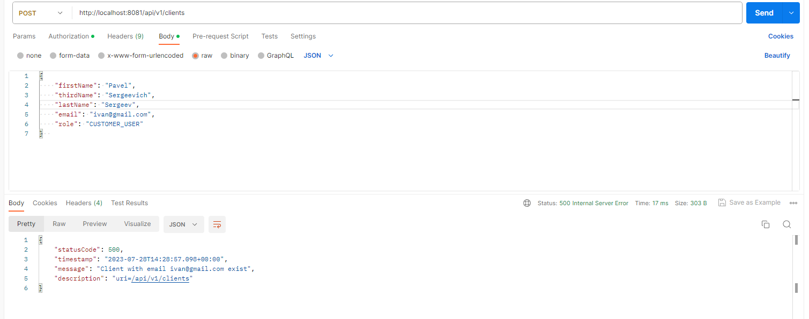
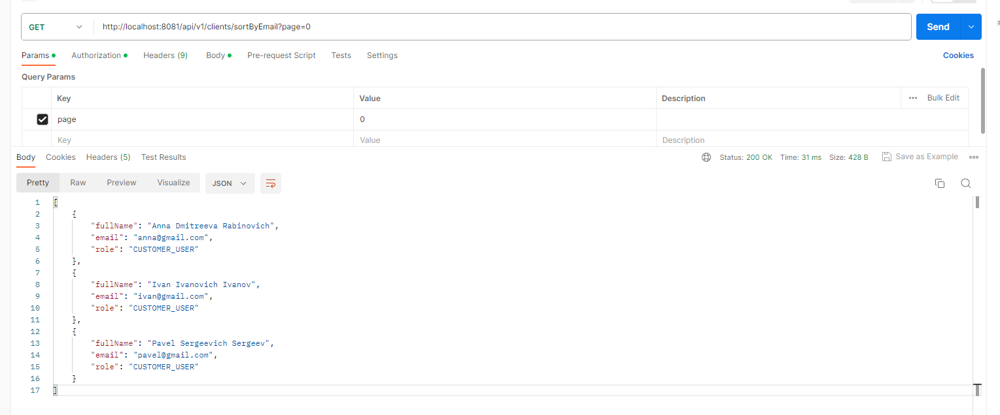
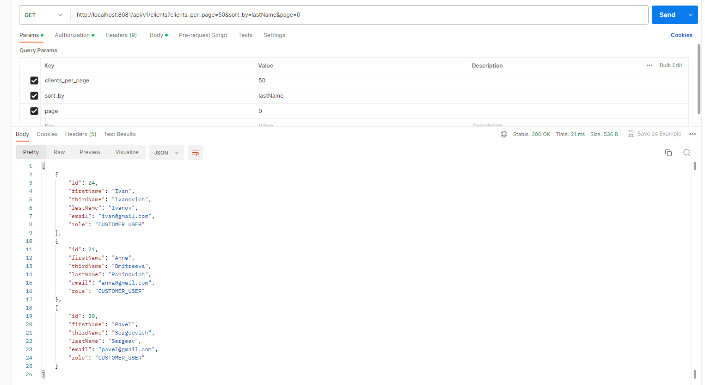

Project: service for adding, getting and sorting clients.

The project uses the following technologies:
1. **Docker** - for deployment PostgreSQL and to work with the database (automatic initialization of the database), dockerizing the application and running it in a container.
   
2. **Liquibase** - to track, manage, and enforce database schema changes.
3. **Maven** - to automate the assembly of projects.
4. **Spring Boot** - creating a backend part of the application.
5. **Log4j2** - is responsible for writing information to log files based on the specified logging levels. The main task of the logger is not to miss the event that needs to be written to the log file.
   
6. **Mapstruct** - to generate code for passing data between different entities in the program. It helps to map objects from one entity to another.
7. **Validation** - to check the correctness of entering user data.
8. **Swagger** - for documenting application endpoints.
   
9.  **Testing** - unit tests to test the service layer and integration tests to test the controller layer using Mockito framework and Testcontainers.

**Project description:**
The project has an endpoint for saving clients: http://localhost:8081/api/v1/clients
   
If incorrect data was sent (wrong email, wrong field length, null values, names contain non-Latin letters, non-unique email), an exception will be thrown.
   
   
   
   
The application has an endpoint for receiving clients sorted by email and displaying 10 clients per page: http://localhost:8081/api/v1/clients/sortByEmail?page=0
   
The application has an endpoint for receiving clients in a sorted form, where you can set the number of clients on the page, as well as the field by which you want to sort: http://localhost:8081/api/v1/clients?clients_per_page=50&sort_by=email&page=0
   

